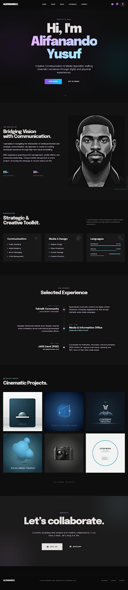

# ALIFANANDO YUSUF — Cinematic Portfolio 🎬

A premium, high-performance portfolio website built for a client, **Alifanando Yusuf Suwandono**. This project features a sophisticated "Cinematic Curator" aesthetic with advanced scroll interactions and motion design.



## 🌐 Project Overview

This project serves as the digital professional hub for **Alifanando Yusuf Suwandono**, an Applied Foreign Language student at **Diponegoro University** specializing in Creative Communication and Media. The site was developed to showcase the client's intersection of strategic communication and visual storytelling.

## ✨ Key Features

### 🌪️ Advanced Motion System
- **Smooth Scrolling (Lenis):** Implementing industry-standard inertial scrolling for a premium, weighted feel.
- **GSAP ScrollTrigger:** Precision-timed scroll animations with multi-layer depth.
- **Multi-layer Parallax:** Responsive background glow elements that react to scroll velocity.
- **Mouse Tracking Parallax:** Hero section elements that subtly follow cursor movement using `requestAnimationFrame` for maximum performance.

### 🎭 Visual Excellence
- **Cinematic Design System:** A custom-curated dark theme with vibrant glows, glassmorphism, and modern typography (Epilogue & Inter).
- **Responsive Layout:** Optimized for all screen sizes from mobile to ultra-wide displays.
- **Interactive Cards:** Hover-aware project cards with smooth scaling and overlay transitions.

### 📊 Data-Driven Sections
- **Dynamic Experience Timeline:** Comprehensive journey from Yuktalk to Diponegoro University.
- **Capability Matrix:** Visual display of creative toolkit and language proficiencies.
- **Automated Contact:** Integrated deep links for direct Email and WhatsApp communication.

## 🛠️ Technology Stack

| Category | Technology |
|---|---|
| **Client** | Alifanando Yusuf Suwandono |
| **Core** | React 19, Vite |
| **Styling** | Tailwind CSS v4 |
| **Animation** | GSAP, ScrollTrigger |
| **Scroller** | Lenis (by Studio Freight) |
| **Fonts** | Google Fonts (Epilogue, Inter, Space Grotesk) |
| **Icons** | Material Symbols Outlined |

## 🚀 Getting Started

### Prerequisites

- Node.js (Latest LTS recommended)
- npm or pnpm

### Installation

1. Clone the repository:
   ```bash
   git clone https://github.com/yourusername/alifanando-yusuf-portofolio.git
   ```

2. Install dependencies:
   ```bash
   npm install
   ```

3. Run the development server:
   ```bash
   npm run dev
   ```

4. Build for production:
   ```bash
   npm run build
   ```

## 📂 Project Structure

```text
src/
├── components/          # Reusable UI elements (Navbar, Footer)
├── sections/            # Major page sections (Hero, About, Projects, etc.)
├── hooks/               # Custom hooks for Lenis and GSAP logic
├── assets/              # Static media files
├── index.css            # Tailwind CSS v4 theme and custom utilities
└── App.jsx              # Main application entry and parallax setup
---
```
*This project and all associated content represent the professional portfolio of the client, Alifanando Yusuf Suwandono.*
